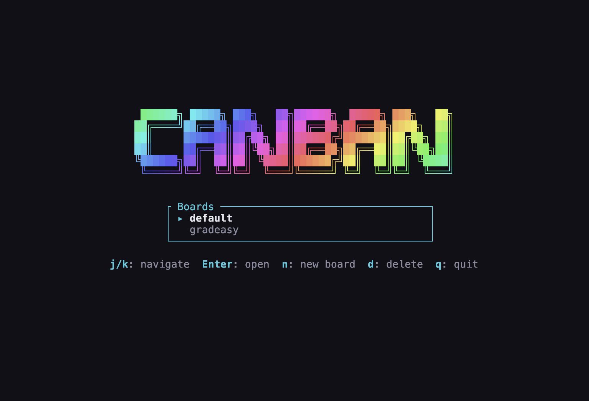
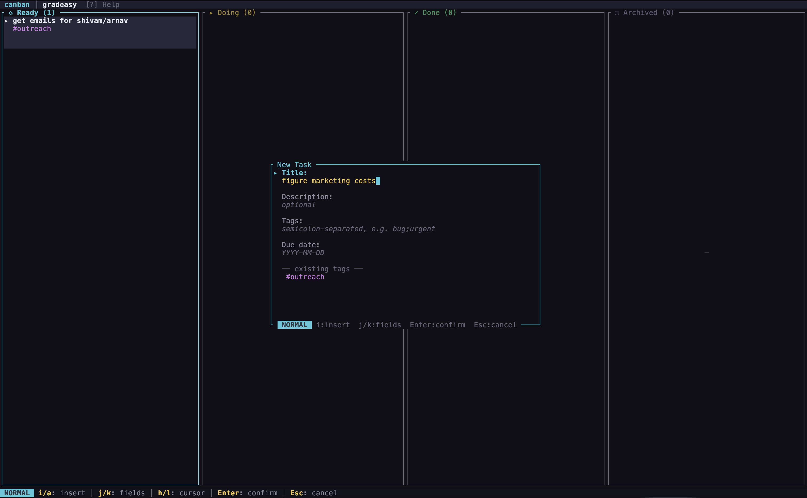

<p align="center">
  
</p>

<h1 align="center">canban</h1>

<p align="center">
  <strong>A fast, minimal Kanban board for the terminal — with vim keybindings.</strong>
</p>

<p align="center">
  <a href="https://crates.io/crates/canban"></a>
  <a href="https://github.com/thearnavrustagi/canban/actions"></a>
  <a href="https://github.com/thearnavrustagi/canban/blob/main/LICENSE"></a>
  <a href="https://crates.io/crates/canban"></a>
</p>

<p align="center">
  <a href="#installation">Installation</a> •
  <a href="#features">Features</a> •
  <a href="#usage">Usage</a> •
  <a href="#keybindings">Keybindings</a> •
  <a href="#configuration">Configuration</a> •
  <a href="#contributing">Contributing</a>
</p>

---

<p align="center">
  
</p>

## Why canban?

Most project management tools are browser tabs you forget about. **canban** lives where you already work — the terminal. It launches instantly, navigates with vim motions, and saves automatically. No accounts, no cloud, no friction.

- **Zero startup time** — opens faster than you can context-switch
- **Vim-native** — `hjkl` navigation, modal editing, command mode with `:wq`
- **Offline-first** — everything stored locally as JSON, fully portable
- **Keyboard-only** — never touch the mouse

## Installation

### From crates.io (recommended)

```bash
cargo install canban
```

### From source

```bash
git clone https://github.com/thearnavrustagi/canban.git
cd canban
cargo install --path .
```

### From GitHub Releases

Pre-built binaries for macOS, Linux, and Windows are available on the [Releases](https://github.com/thearnavrustagi/canban/releases) page.

### Requirements

- Rust 1.70+ (if building from source)
- A terminal with 256-color or truecolor support

## Features

### Four-column workflow

Organize tasks across **Ready**, **Doing**, **Done**, and **Archived** columns — each color-coded and clearly separated.

### Vim-style everything

Full vim keybindings in both board navigation and text input. Normal mode, insert mode, word motions (`w`, `b`), line motions (`0`, `$`), and operators (`C`, `x`, `S`) — all work exactly as you'd expect.

### Rich task cards

Each task supports a title, description, tags, and due dates. Tasks in the **Doing** column automatically track time. Overdue tasks glow red.

### Multiple boards

Create, switch, and delete boards on the fly. Each board is stored independently — use them for different projects, contexts, or workflows.

### Search & filter

Press `/` to instantly filter tasks by title, tag, or description. Results update as you type.

### CSV import/export

Move data in and out with CSV. Great for syncing with spreadsheets, migrating from other tools, or backing up your boards.

### Auto-save

Changes persist automatically. No manual saving needed (though `:w` works if you want it to).

### Splash screen

A clean animated splash screen on launch with a board picker to jump straight into your project.

## Usage

```bash
# Launch the TUI (creates a default board on first run)
canban

# List all boards
canban boards

# Export active board to CSV
canban export -o tasks.csv

# Import a board from CSV
canban import -i tasks.csv
```

## Keybindings

### Board — Normal Mode

| Key | Action |
|---|---|
| `h` / `l` | Move between columns |
| `j` / `k` | Move between tasks |
| `g` / `G` | Jump to first / last task |
| `1`–`4` | Jump to column by number |
| `Tab` | Cycle columns forward |
| `n` / `a` | New task |
| `Enter` / `e` | Edit task |
| `r` | Rename task inline |
| `d` | Delete task (with confirmation) |
| `Space` / `m` | Move task to next column |
| `M` | Move task to previous column |
| `t` | Set tags |
| `D` | Set due date |
| `/` | Search / filter |
| `?` | Toggle help overlay |
| `:` | Enter command mode |
| `b` | Switch board |
| `q` | Quit |

### Dialog — Normal Mode (vim)

| Key | Action |
|---|---|
| `i` | Insert at cursor |
| `a` / `A` | Append at cursor / end of line |
| `I` | Insert at start of field |
| `h` / `l` | Move cursor left / right |
| `w` / `b` | Jump word forward / backward |
| `0` / `$` | Jump to start / end of field |
| `x` / `X` | Delete forward / backward |
| `C` | Change to end of field |
| `S` / `c` | Clear field and enter insert mode |
| `j` / `k` | Next / previous field |
| `Enter` | Confirm |
| `Esc` / `q` | Cancel |

### Dialog — Insert Mode

| Key | Action |
|---|---|
| `Esc` | Return to normal mode |
| `Tab` / `Shift-Tab` | Next / previous field |
| `Ctrl-w` | Delete word backward |
| `Ctrl-u` | Clear entire field |
| `Enter` | Confirm |

### Command Mode

| Command | Action |
|---|---|
| `:q` / `:quit` | Quit |
| `:w` / `:save` | Save |
| `:wq` | Save and quit |

## Configuration

canban uses XDG-compliant paths:

| What | Path |
|---|---|
| Config | `$XDG_CONFIG_HOME/canban/config.toml` |
| Board data | `$XDG_DATA_HOME/canban/boards/<name>/tasks.json` |

> On macOS, data defaults to `~/Library/Application Support/canban/`.

### `config.toml`

```toml
active_board = "default"
done_limit = 20

[columns]
visible = ["ready", "doing", "done", "archived"]

[display]
column_min_width = 24
show_footer = true
```

| Key | Description | Default |
|---|---|---|
| `active_board` | Board to open on launch | `"default"` |
| `done_limit` | Max visible tasks in Done column | `20` |
| `columns.visible` | Which columns to show | All four |
| `display.column_min_width` | Minimum column width in cells | `24` |
| `display.show_footer` | Show bottom status bar | `true` |

## Data Format

Boards are stored as JSON. Each task looks like:

```json
{
  "id": "a1b2c3d4-...",
  "title": "Write README",
  "description": "Make it good for open source",
  "tags": ["docs", "oss"],
  "due_date": "2026-03-01",
  "column": "doing",
  "created_at": "2026-02-20T10:00:00Z",
  "updated_at": "2026-02-26T14:30:00Z",
  "doing_started_at": "2026-02-25T09:00:00Z",
  "cumulative_doing_secs": 3600
}
```

CSV export/import uses the same fields for interoperability.

## Architecture

```
src/
├── main.rs            # CLI entry point (clap)
├── app.rs             # Application state machine & event loop
├── config.rs          # TOML configuration loading
├── event.rs           # Keyboard/tick event polling
├── model/
│   ├── board.rs       # Board (name + tasks)
│   ├── column.rs      # ColumnKind enum with transitions
│   └── task.rs        # Task struct with metadata
├── storage/
│   ├── mod.rs         # StorageBackend trait
│   ├── json_backend.rs # JSON persistence
│   └── csv_backend.rs  # CSV import/export
└── ui/
    ├── mod.rs         # Top-level render dispatch
    ├── board.rs       # Column layout & scrolling
    ├── card.rs        # Task card rendering
    ├── dialog.rs      # Input/confirm/picker dialogs
    ├── help.rs        # Help overlay
    ├── splash.rs      # Animated splash screen
    └── theme.rs       # Color palette & styles
```

Built with [ratatui](https://ratatui.rs) for rendering and [crossterm](https://github.com/crossterm-rs/crossterm) for terminal I/O.

## Contributing

Contributions are welcome! Please read [CONTRIBUTING.md](CONTRIBUTING.md) before submitting a pull request.

Quick start:

```bash
git clone https://github.com/thearnavrustagi/canban.git
cd canban
cargo run
```

See the [open issues](https://github.com/thearnavrustagi/canban/issues) for things to work on, or suggest your own.

## Roadmap

- [ ] Custom color themes
- [ ] Task priorities
- [ ] Subtasks / checklists
- [ ] Drag-and-drop with mouse support
- [ ] Board templates
- [ ] Undo / redo
- [ ] Sync across machines (optional)
- [ ] Plugin system

## License

[MIT](LICENSE)

---

<p align="center">
  <sub>Built with Rust, ratatui, and too much coffee.</sub>
</p>
